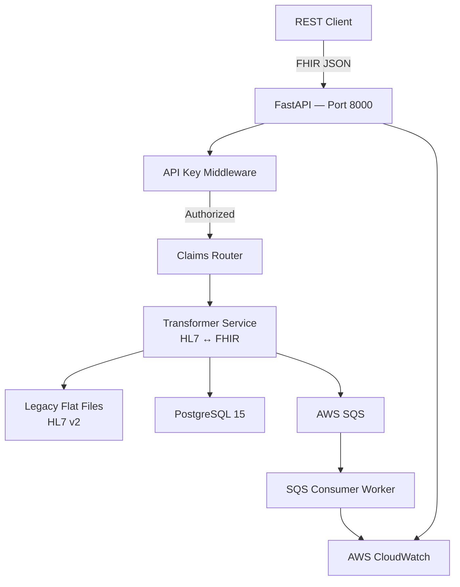

# ClaimsBridge

Most healthcare systems still run on infrastructure from the 1980s. This project is about what you do with that — not rewrite it, but wrap it. ClaimsBridge puts a modern FHIR-compliant API in front of a legacy HL7 v2 claims processor, adds a PostgreSQL migration layer, and wires it all together with an AWS event bus. 

**Live API:** `http://3.14.85.62:8000/docs`

---

## The Architecture Story

Legacy flat-file system → FastAPI middleware wrapper → FHIR-compliant REST API → SQS event bus → PostgreSQL modern data store → EC2 deployment with GitHub Actions CI/CD.

Here's how it fits together:



---

## Tech Stack

| Layer | Technology | Why |
|---|---|---|
| Legacy simulator | Python flat file I/O | Mimics real COBOL/batch behavior |
| API middleware | FastAPI + Pydantic | FHIR resource modeling |
| Event bus | AWS SQS | Industry-standard async messaging |
| Modernized store | PostgreSQL 15 | Migration target data store |
| Auth | API key middleware | Enforced at infrastructure boundary |
| Containerization | Docker + Docker Compose | Consistent local and production environments |
| Deployment | AWS EC2 (t3.micro) | Live cloud deployment |
| CI/CD | GitHub Actions | Auto-deploy on push to main |
| Observability | Structured JSON logging | CloudWatch-compatible log format |

---

## Project Structure

```
claimsbridge/
├── legacy/                  # The "old system" — flat file processor
│   ├── generator.py         # Generates HL7 v2 claim records
│   ├── processor.py         # Reads/writes flat files, simulates batch jobs
│   └── sample_data/         # HL7 v2 flat files + processed output
├── api/                     # The modernization layer
│   ├── main.py              # FastAPI app entrypoint + Swagger config
│   ├── routers/
│   │   ├── claims.py        # FHIR-style claims endpoints
│   │   └── health.py        # Health check endpoint
│   ├── models/
│   │   ├── hl7.py           # HL7 v2 parsing models
│   │   └── fhir.py          # FHIR resource models
│   ├── services/
│   │   ├── transformer.py   # HL7 → FHIR transformation logic
│   │   ├── sqs.py           # SQS event publishing
│   │   ├── db.py            # PostgreSQL connection + queries
│   │   └── logger.py        # Structured JSON logging
│   └── middleware/
│       └── auth.py          # API key authentication
├── worker/
│   └── consumer.py          # SQS consumer — polls and processes events
├── .github/
│   └── workflows/
│       └── deploy.yml       # GitHub Actions CI/CD to EC2
├── docker-compose.yml
├── Dockerfile
└── .env.example
```

---

## API Endpoints

| Method | Endpoint | Auth | Description |
|---|---|---|---|
| GET | `/health` | None | Health check |
| GET | `/claims/` | API Key | List all claims (FHIR format) |
| POST | `/claims/` | API Key | Submit a new claim |
| GET | `/claims/{claim_id}` | API Key | Retrieve a claim by ID |

**Try it live:** The API is live and open for exploration. Open `/docs`, click **Authorize**, enter the API key (claimsbridge-local-key-123), and execute requests directly from the browser. 

### Example Request

```bash
curl -X POST http://3.14.85.62:8000/claims/ \
  -H "X-API-Key: your-api-key" \
  -H "Content-Type: application/json" \
  -d '{
    "patient_id": "P99001",
    "provider_id": "D99001",
    "amount": 2450.00,
    "diagnosis_code": "I21.9",
    "procedure_code": "99213"
  }'
```

### Example Response

```json
{
  "resourceType": "Claim",
  "id": "generated-claim-id",
  "status": "active",
  "patient": {
    "resourceType": "Patient",
    "id": "P99001"
  },
  "diagnosis": {
    "code": "I21.9",
    "description": "I21.9"
  },
  "totalCharge": 2450.00,
  "admissionDate": "20260402"
}
```

---

## Local Development

**Prerequisites:** Docker, Docker Compose, AWS account with SQS queue

```bash
git clone https://github.com/jordan-bm/claimsbridge.git
cd claimsbridge
cp .env.example .env
# Fill in your values in .env
docker compose up --build
```

API available at `http://localhost:8000`

`.env.example`:
```
DATABASE_URL=postgresql://postgres:postgres@db:5432/claimsbridge
API_KEY=your-api-key-here
AWS_ACCESS_KEY_ID=your-key
AWS_SECRET_ACCESS_KEY=your-secret
AWS_REGION=us-east-1
SQS_QUEUE_URL=your-queue-url
```

---

## Deployment

ClaimsBridge runs on AWS EC2 via Docker Compose. GitHub Actions handles CI/CD — every push to `main` SSHes into the instance and redeploys the stack automatically.

```yaml
# .github/workflows/deploy.yml
on:
  push:
    branches: [main]
```

---

## Healthcare 

Most hospital and payer systems still run on HL7 v2 — a flat file format from 1987. It works, but CMS is now mandating FHIR-compliant APIs, and nobody wants to rewrite a claims system that processes millions of records just to modernize the interface. ClaimsBridge is built around that exact problem. The legacy system keeps running untouched. A modern API layer sits in front of it, speaks FHIR to the outside world, writes to both the old flat files and a new PostgreSQL store at the same time, and fires events to a queue so downstream systems can plug in without ever touching the legacy core. It's the migration pattern I'd want to work on.

---

## Other Industries

The healthcare context is specific, but the problem isn't. Legacy transaction processors, batch payment systems, aging monoliths — every industry has them, and none of them can be taken offline for a rewrite. ClaimsBridge demonstrates the standard playbook for this: wrap the legacy I/O in a REST API, stand up a modern data store alongside it, and use an event queue to decouple anything downstream. The result is a system that's fully deployed on AWS, auth-gated, observable, and continuously delivered.

---

## Key Concepts 

- **Strangler Fig Pattern** — incrementally modernize a legacy system without taking it offline
- **Dual-write** — write to both old and new data stores simultaneously during migration; allows rollback
- **ETL pipeline** — Extract (HL7 flat file), Transform (HL7 → FHIR), Load (PostgreSQL + SQS)
- **Event-driven architecture** — SQS decouples the API from downstream consumers
- **Idempotent schema migrations** — `create_tables()` uses SQLAlchemy `metadata.create_all()`, safe on existing data
- **Structured observability** — every log line is JSON, CloudWatch-ready on deploy
